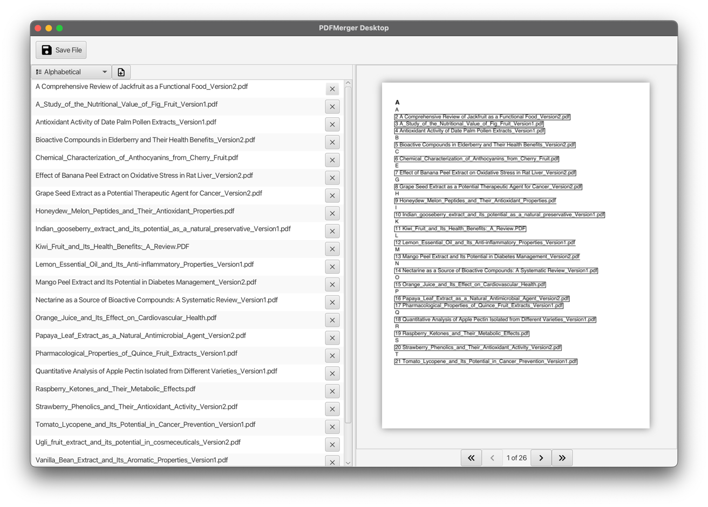

# PDF Merger Desktop

PDF Merger Desktop is a Java application that allows users to merge multiple PDF files into a single document. 
It is still under development and may have some bugs.

Features
- Merge multiple PDF files into a single document
- Generate a table of contents that lists all the merged documents
- Interactive table of contents with clickable links that jump to the referenced page in the document
- Cross-platform compatibility (Windows, macOS, and (soon) Linux)
- Open source

### License
This project is licensed under the MIT License.

# Screenshots

# Known Issues
### Unsigned Installers:
Please note that the installers provided in this repository are currently not signed. As a result, when running the installer on your operating system, you may encounter warning messages or prompts related to the lack of digital signatures.

### No Linux Build: 
Currently, there is no automated Linux release available for this application, despite the possibility of using JavaFX on Linux platforms. The focus of development has been primarily on Windows and macOS. However, you can still run the application on Linux by manually building and running it from the source code. Future releases may include pre-built Linux binaries to provide better support for Linux users.
